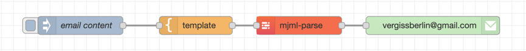
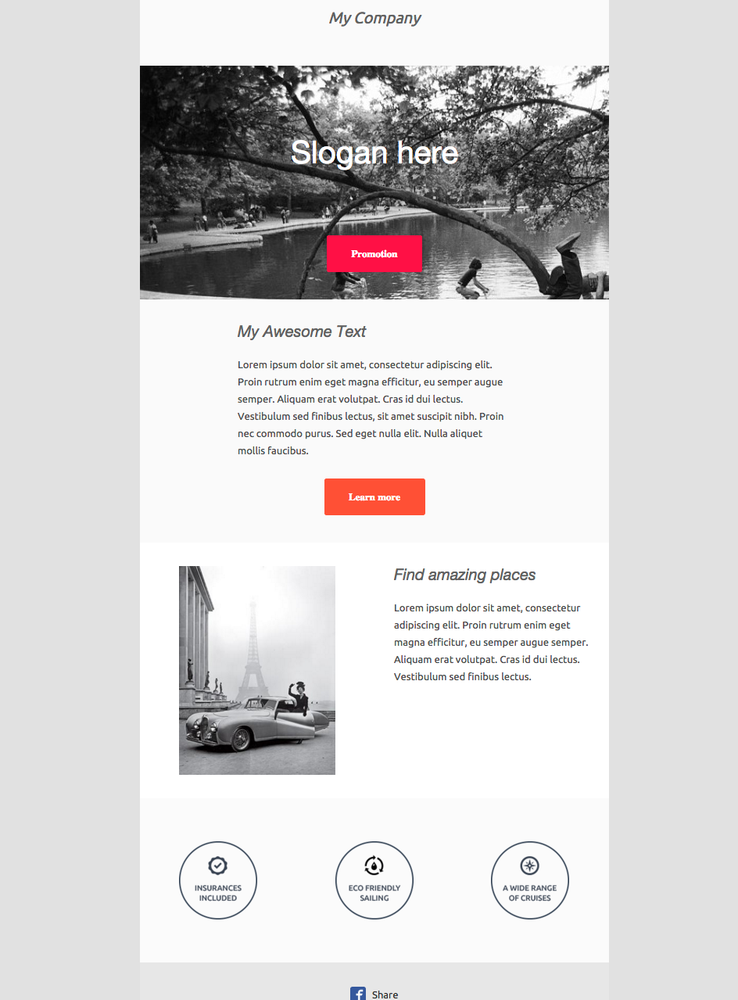

# node-red-contrib-mjml 
[](https://crowdin.com/project/node-red-contrib-mjml)

Node for NodeRED to create emails with MJML language. It provides a NodeRED node to parse your template and output HTML.

## Installation

Change directory to your NodeRED installation and issue:

```shell
npm install @vergissberlin/node-red-contrib-mjml
```

or

```shell
yarn add @vergissberlin/node-red-contrib-mjml
```

or

go to your pallet settings in your NodeRED admin ui and search for "mjml".


## Getting Started

In this repo there is `example-flow.json`. You can import that into a NodeRED workspace and it will provide a template
for getting working with the MJML node.



## Basic template example

In this section, you're going to learn how to code a basic email template using MJML.

```xml

<mjml>
    <mj-body>
        <mj-raw>
            <!-- Company Header -->
        </mj-raw>
        <mj-section background-color="#f0f0f0">
            <mj-column>
                <mj-text font-style="italic" font-size="20px" color="#626262">My Company</mj-text>
            </mj-column>
        </mj-section>
        <mj-raw>
            <!-- Image Header -->
        </mj-raw>
        <mj-section
                background-url="http://1.bp.blogspot.com/-TPrfhxbYpDY/Uh3Refzk02I/AAAAAAAALw8/5sUJ0UUGYuw/s1600/New+York+in+The+1960's+-+70's+(2).jpg"
                background-size="cover" background-repeat="no-repeat">
            <mj-column width="600px">
                <mj-text align="center" color="#fff" font-size="40px" font-family="Helvetica Neue">Slogan here</mj-text>
                <mj-button background-color="#F63A4D" href="#">Promotion</mj-button>
            </mj-column>
        </mj-section>
        <mj-raw>
            <!-- Intro text -->
        </mj-raw>
        <mj-section background-color="#fafafa">
            <mj-column width="400px">
                <mj-text font-style="italic" font-size="20px" font-family="Helvetica Neue" color="#626262">My Awesome
                    Text
                </mj-text>
                <mj-text color="#525252">Lorem ipsum dolor sit amet, consectetur adipiscing elit. Proin rutrum enim eget
                    magna efficitur, eu semper augue semper. Aliquam erat volutpat. Cras id dui lectus. Vestibulum sed
                    finibus lectus, sit amet suscipit nibh. Proin nec commodo purus.
                    Sed eget nulla elit. Nulla aliquet mollis faucibus.
                </mj-text>
                <mj-button background-color="#F45E43" href="#">Learn more</mj-button>
            </mj-column>
        </mj-section>
        <mj-raw>
            <!-- Side image -->
        </mj-raw>
        <mj-section background-color="white">
            <mj-raw>
                <!-- Left image -->
            </mj-raw>
            <mj-column>
                <mj-image width="200px"
                          src="https://designspell.files.wordpress.com/2012/01/sciolino-paris-bw.jpg"></mj-image>
            </mj-column>
            <mj-raw>
                <!-- right paragraph -->
            </mj-raw>
            <mj-column>
                <mj-text font-style="italic" font-size="20px" font-family="Helvetica Neue" color="#626262">Find amazing
                    places
                </mj-text>
                <mj-text color="#525252">Lorem ipsum dolor sit amet, consectetur adipiscing elit. Proin rutrum enim eget
                    magna efficitur, eu semper augue semper. Aliquam erat volutpat. Cras id dui lectus. Vestibulum sed
                    finibus lectus.
                </mj-text>
            </mj-column>
        </mj-section>
        <mj-raw>
            <!-- Icons -->
        </mj-raw>
        <mj-section background-color="#fbfbfb">
            <mj-column>
                <mj-image width="100px" src="http://191n.mj.am/img/191n/3s/x0l.png"></mj-image>
            </mj-column>
            <mj-column>
                <mj-image width="100px" src="http://191n.mj.am/img/191n/3s/x01.png"></mj-image>
            </mj-column>
            <mj-column>
                <mj-image width="100px" src="http://191n.mj.am/img/191n/3s/x0s.png"></mj-image>
            </mj-column>
        </mj-section>
    </mj-body>
</mjml>
```

### Result


Looks cool, right?

[try it live!](https://mjml.io/try-it-live/templates/basic)

## How does MJML work?

With MJML, you can easily develop responsive email without the pain of coding. Its semantic syntax and standard components library speed up your development process, and MJML's open-source engine generates code in under a minute. This open-source engine generates high quality responsive HTML that adheres to best practices. It is an effective tool for creating emails that has a very intuitive interface.

The node `mjml-parse` is a NodeRED node that parses your MJML template and outputs the HTML.


## Further reading

- [MJML documentation](https://documentation.mjml.io)
- [MJML templates](https://mjml.io/templates)
- [MJML live editor](https://mjml.io/try-it-live)
- [MJML vscode extension](https://marketplace.visualstudio.com/items?itemName=mjmlio.vscode-mjml)
