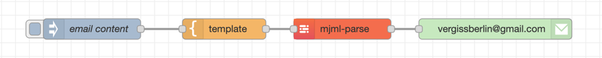
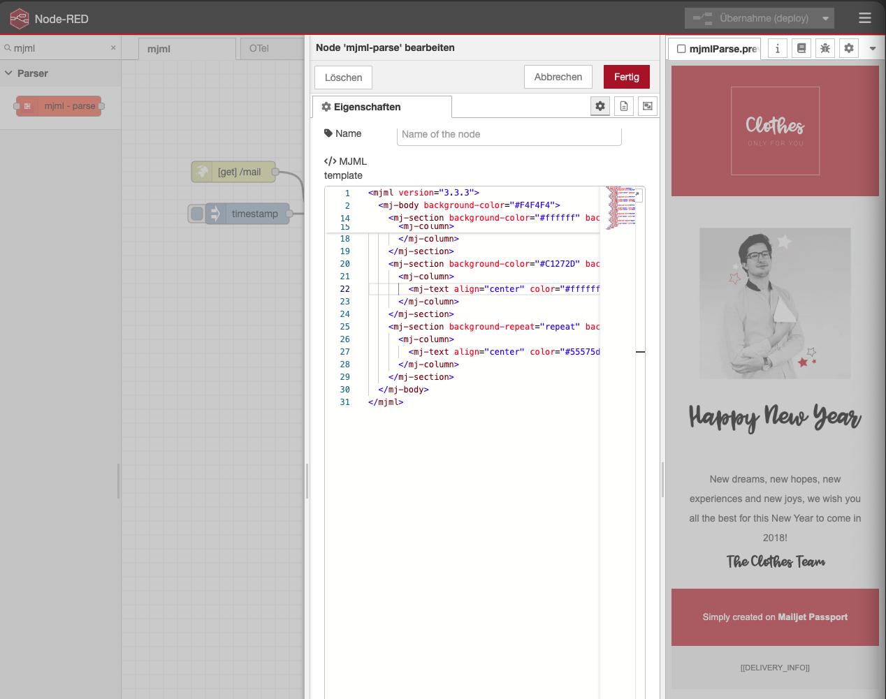

# node-red-contrib-mjml

[](https://www.npmjs.com/package/@vergissberlin/node-red-contrib-mjml)
[](https://crowdin.com/project/node-red-contrib-mjml)
[](https://github.com/vergissberlin/node-red-contrib-mjml/issues)
[](https://github.com/vergissberlin/node-red-contrib-mjml/blob/main/LICENSE)

Node for NodeRED to create emails with MJML language. It provides a NodeRED node to parse your template and output HTML.

## Installation

Change directory to your NodeRED installation and issue:

```shell
npm install @vergissberlin/node-red-contrib-mjml
```

**OR** go to your pallet settings in your NodeRED admin ui and search for "mjml".

## Getting Started

In this repo there is `example-flow.json`. You can import that into a NodeRED workspace and it will provide a template
for getting working with the MJML node.



## Basic template example

In this section, you're going to learn how to code a basic email template using MJML.

```xml
<mjml>
    <mj-body>
        <mj-raw>
            <!-- Company Header -->
        </mj-raw>
        <mj-section background-color="#f0f0f0">
            <mj-column>
                <mj-text font-style="italic" font-size="20px" color="#626262">
                    My Company
                </mj-text>
            </mj-column>
        </mj-section>
        <mj-raw>
            <!-- Image Header -->
        </mj-raw>
        <mj-section
                background-url="http://1.bp.blogspot.com/-TPrfhxbYpDY/Uh3Refzk02I/AAAAAAAALw8/5sUJ0UUGYuw/s1600/New+York+in+The+1960's+-+70's+(2).jpg"
                background-size="cover" 
                background-repeat="no-repeat">
            <mj-column width="600px">
                <mj-text align="center" color="#fff" font-size="40px" font-family="Helvetica Neue">
                    Slogan here
                </mj-text>
                <mj-button background-color="#F63A4D" href="#">Promotion</mj-button>
            </mj-column>
        </mj-section>
        <mj-raw>
            <!-- Intro text -->
        </mj-raw>
        <mj-section background-color="#fafafa">
            <mj-column width="400px">
                <mj-text font-style="italic" font-size="20px" font-family="Helvetica Neue" color="#626262">My Awesome
                    Text
                </mj-text>
                <mj-text color="#525252">
                    Lorem ipsum dolor sit amet, consectetur adipiscing elit. 
                    Proin rutrum enim eget magna efficitur, eu semper augue semper. 
                    Aliquam erat volutpat. Cras id dui lectus. Vestibulum sed
                    finibus lectus, sit amet suscipit nibh. Proin nec commodo purus.
                    Sed eget nulla elit. Nulla aliquet mollis faucibus.
                </mj-text>
                <mj-button background-color="#F45E43" href="#">Learn more</mj-button>
            </mj-column>
        </mj-section>
        <mj-raw>
            <!-- Side image -->
        </mj-raw>
        <mj-section background-color="white">
            <mj-raw>
                <!-- Left image -->
            </mj-raw>
            <mj-column>
                <mj-image width="200px"
                          src="https://designspell.files.wordpress.com/2012/01/sciolino-paris-bw.jpg"></mj-image>
            </mj-column>
            <mj-raw>
                <!-- right paragraph -->
            </mj-raw>
            <mj-column>
                <mj-text font-style="italic" font-size="20px" font-family="Helvetica Neue" color="#626262">
                    Find amazing places
                </mj-text>
                <mj-text color="#525252">
                    Lorem ipsum dolor sit amet, consectetur adipiscing elit. Proin rutrum enim eget
                    magna efficitur, eu semper augue semper. Aliquam erat volutpat. Cras id dui lectus. Vestibulum sed finibus lectus.
                </mj-text>
            </mj-column>
        </mj-section>
        <mj-raw>
            <!-- Icons -->
        </mj-raw>
        <mj-section background-color="#fbfbfb">
            <mj-column>
                <mj-image width="100px" src="http://191n.mj.am/img/191n/3s/x0l.png"></mj-image>
            </mj-column>
            <mj-column>
                <mj-image width="100px" src="http://191n.mj.am/img/191n/3s/x01.png"></mj-image>
            </mj-column>
            <mj-column>
                <mj-image width="100px" src="http://191n.mj.am/img/191n/3s/x0s.png"></mj-image>
            </mj-column>
        </mj-section>
    </mj-body>
</mjml>
```

### Result


Looks cool, right?

[try it live!](https://mjml.io/try-it-live/templates/basic)

## How does MJML work?

With MJML, you can easily develop responsive email without the pain of coding. Its semantic syntax and standard components library speed up your development process, and MJML's open-source engine generates code in under a minute. This open-source engine generates high quality responsive HTML that adheres to best practices. It is an effective tool for creating emails that has a very intuitive interface.

The node `mjml-parse` is a NodeRED node that parses your MJML template and outputs the HTML.


## MJML editor and placeholders

The `mjml-parse` node now includes an MJML editor in the node configuration dialog:

- XML syntax highlighting with inline XML well-formedness validation
- Inline MJML compiler error highlighting in the editor (line/column markers for semantic MJML issues)
- MJML tag autocomplete and tag-specific attribute autocomplete when the editor uses **Ace** (Monaco does not load the Ace language-tools completer; diagnostics still work)
- Mustache placeholders (for example `{{payload}}`, `{{topic}}`, `{{flow.myValue}}`, `{{global.myValue}}`, `{{env.MY_KEY}}`) similar to the Node-RED Template node
- Starter template dropdown with built-in templates (including a Node-RED inspired layout)
- Live HTML preview in the Node-RED right sidebar (Info/Debug area) rendered by a Node-RED admin endpoint

Node-RED 3+ uses **Monaco** as the default code editor in the node editor; older setups may still use **Ace**. This node integrates with both: diagnostics use Monaco model markers and line decorations, or Ace session annotations and full-line markers, depending on what `RED.editor.createEditor()` returns. To force Ace, set `editorTheme.codeEditor.lib` to `"ace"` in your Node-RED `settings.js` (see [Node-RED documentation](https://nodered.org/docs/user-guide/runtime/configuration)).



### Using starter templates

The editor includes a **Starter template** dropdown with:

- `Simple email`: a clean one-column transactional layout
- `Node-RED style email`: a dark, Node-RED inspired layout for flow notifications
- `Charts report`: an email-safe KPI report with chart-like progress bars and a metric table
- `Minimal announcement`: a lightweight, headline-first broadcast template

How it works:

1. Open the dropdown and choose a starter template.
2. If the editor already contains content, confirm replacement.
3. The selected template is inserted into the editor and validated immediately.
4. The dropdown resets to `No starter template` after insertion.

Both starters are intentionally small and can be customized quickly (colors, CTA text, sections, placeholder names).
The structures are inspired by common MJML template patterns from the official gallery, but implemented as original templates in this project.

Template source priority at runtime:

1. Template configured in the node editor
2. `msg.template`
3. `msg.payload`

MJML semantic validation is still handled by the MJML compiler during runtime.

Preview notes:

- The preview compiles the current editor content on the server side and updates while you type.
- The preview uses MJML compilation only and does not evaluate flow context values or Mustache placeholders.
- The preview endpoint (`POST …/mjml-parse/preview`) is registered on the Node-RED admin API and is protected with `RED.auth.needsPermission('flows.read')` when authentication is enabled (same model as other admin configuration endpoints in the [Node-RED cookbook](https://github.com/node-red/cookbook.nodered.org/wiki/Create-an-admin-configuration-API-endpoint)). Unauthenticated requests are rejected when admin auth is required.

Starter templates and i18n notes:

- Template definitions are stored in `mjml-parse/resources/mjml-templates.json`.
- UI labels are localized via `mjmlParse.templates.*` in `mjml-parse/locales/*/mjml-parse.json`.
- If you add or rename a starter template, update both the JSON resource and locale keys, then run tests.

Autocomplete source reference:

- Generated from `mjml-preset-core` component metadata (`componentName`, `allowedAttributes`) into `mjml-parse/resources/mjml-tags.json`
- Helper tags for editor UX (`mj-all`, `mj-class`, `mj-include`) are retained from the VS Code MJML grammar
- Regenerate after MJML upgrades with:

```bash
pnpm run generate:mjml-tags
```

- [MJML.tmLanguage](https://raw.githubusercontent.com/mjmlio/vscode-mjml/refs/heads/master/syntaxes/MJML.tmLanguage)

## Further reading

- [MJML documentation](https://documentation.mjml.io)
- [MJML templates](https://mjml.io/templates)
- [MJML live editor](https://mjml.io/try-it-live)
- [MJML vscode extension](https://marketplace.visualstudio.com/items?itemName=mjmlio.vscode-mjml)

For release process and contribution details, see [CONTRIBUTING.md](CONTRIBUTING.md).
